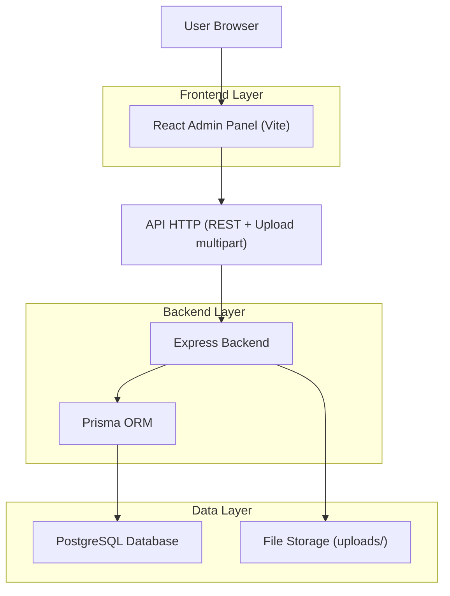
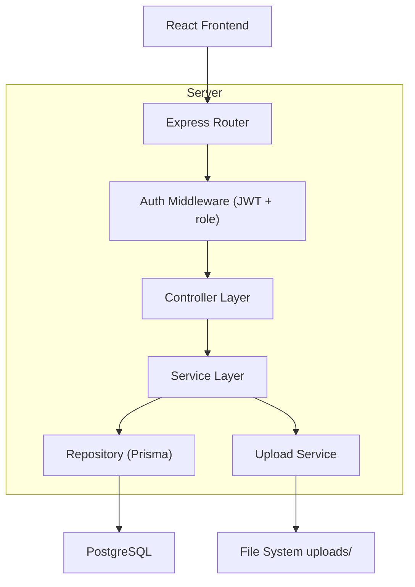
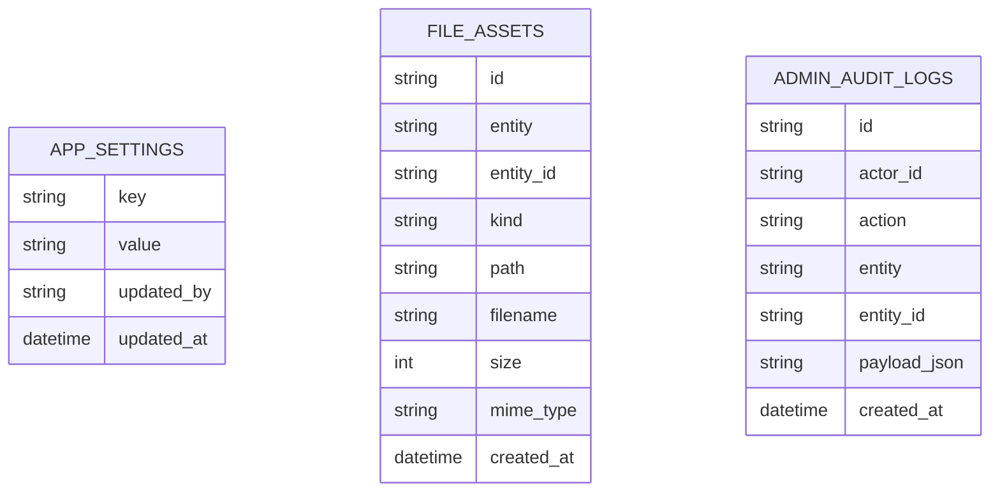

## 1.Architecture design


## 2.Technology Description
- Frontend: React@18 + TypeScript + vite + tailwindcss@3
- Backend: Node.js + Express@4
- Database: PostgreSQL + Prisma
- Uploads: multipart/form-data (ex: multer) + stockage disque `backend/uploads/`
- AuthN/AuthZ: JWT + middleware (vérification token + rôle admin)

## 3.Route definitions
| Route | Purpose |
|-------|---------|
| /admin/login | Connexion administrateur |
| /admin | Console Admin (gestion entités) |
| /admin/settings | Configuration + journal d’actions |

## 4.API definitions
### 4.1 Conventions
- Toutes les routes admin sont préfixées par `/api/admin/*` et protégées par `Authorization: Bearer <token>`.
- Format standard d’erreur: `{ code: string, message: string, details?: any }`.

### 4.2 Types partagés (TypeScript)
```ts
type ID = string;

type AdminAuditAction =
  | "CREATE" | "UPDATE" | "DELETE"
  | "UPLOAD" | "APPROVE" | "REJECT" | "SETTINGS_UPDATE";

export interface AdminUser {
  id: ID;
  email: string;
  role: "admin" | "user";
}

export interface FileAsset {
  id: ID;
  entity: string;      // ex: "courses", "exercises"
  entityId: ID;
  kind: "pdf" | "image" | "video";
  path: string;        // chemin serveur ou URL
  filename: string;
  size: number;
  mimeType: string;
  createdAt: string;
}

export interface AppSetting {
  key: string;
  value: string;       // stocké en string, parse côté client si nécessaire
  updatedAt: string;
  updatedBy: ID;
}
```

### 4.3 Auth Admin
`POST /api/auth/login`
- Body: `{ email: string, password: string }`
- Response: `{ token: string, user: AdminUser }`

### 4.4 CRUD générique par entité
Pour chaque entité gérée (ex: users, subjects, courses, exercises, homeworks, parascolaires, planner, contacts) :
- `GET /api/admin/{entity}?q=&page=&pageSize=&sort=&filters=`
- `GET /api/admin/{entity}/{id}`
- `POST /api/admin/{entity}`
- `PUT /api/admin/{entity}/{id}`
- `DELETE /api/admin/{entity}/{id}`

### 4.5 Uploads (attachés à une entité)
- `POST /api/admin/assets/upload` (multipart)
  - form-data: `file`, `entity`, `entityId`, `kind`
  - Response: `FileAsset`
- `DELETE /api/admin/assets/{id}`

### 4.6 Workflow validation (si l’entité supporte un statut)
- `POST /api/admin/{entity}/{id}/approve`
- `POST /api/admin/{entity}/{id}/reject`

### 4.7 Settings
- `GET /api/admin/settings`
- `PUT /api/admin/settings` (Body: `{ items: AppSetting[] }`)

### 4.8 Audit log
- `GET /api/admin/audit?entity=&entityId=&action=&page=`

## 5.Server architecture diagram


## 6.Data model(if applicable)
### 6.1 Data model definition


### 6.2 Data Definition Language
App Settings (`app_settings`)
```sql
CREATE TABLE app_settings (
  key TEXT PRIMARY KEY,
  value TEXT NOT NULL,
  updated_by TEXT NOT NULL,
  updated_at TIMESTAMPTZ NOT NULL DEFAULT NOW()
);
```

Assets (`file_assets`)
```sql
CREATE TABLE file_assets (
  id UUID PRIMARY KEY DEFAULT gen_random_uuid(),
  entity TEXT NOT NULL,
  entity_id TEXT NOT NULL,
  kind TEXT NOT NULL,
  path TEXT NOT NULL,
  filename TEXT NOT NULL,
  size INT NOT NULL,
  mime_type TEXT NOT NULL,
  created_at TIMESTAMPTZ NOT NULL DEFAULT NOW()
);
CREATE INDEX idx_file_assets_entity_entityid ON file_assets(entity, entity_id);
```

Audit (`admin_audit_logs`)
```sql
CREATE TABLE admin_audit_logs (
  id UUID PRIMARY KEY DEFAULT gen_random_uuid(),
  actor_id TEXT NOT NULL,
  action TEXT NOT NULL,
  entity TEXT NOT NULL,
  entity_id TEXT,
  payload_json TEXT,
  created_at TIMESTAMPTZ NOT NULL DEFAULT NOW()
);
CREATE INDEX idx_admin_audit_logs_created_at ON admin_audit_logs(created_at DESC);
CREATE INDEX idx_admin_audit_logs_entity ON admin_audit_logs(entity, entity_id);
```

Droits d’accès (principe)
- Toutes les routes `/api/admin/*` exigent un token valide + `role=admin`.
- Les opérations CRUD/upload/validation écrivent systématiquement dans `admin_audit_logs`.