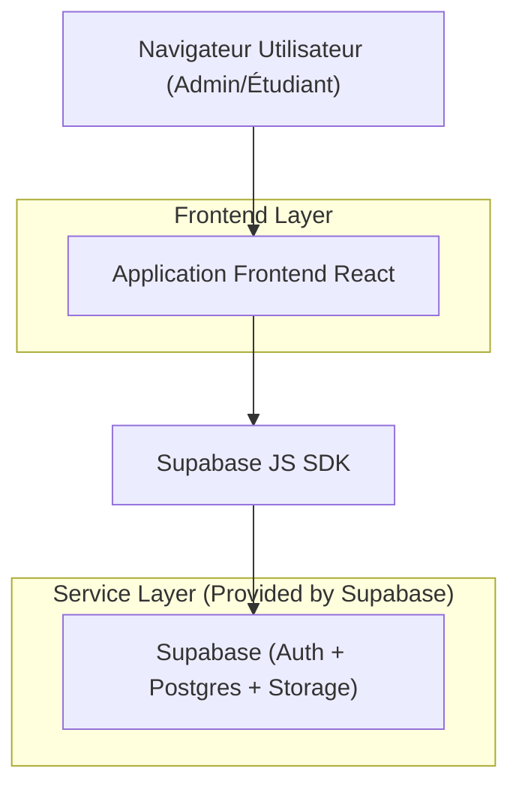
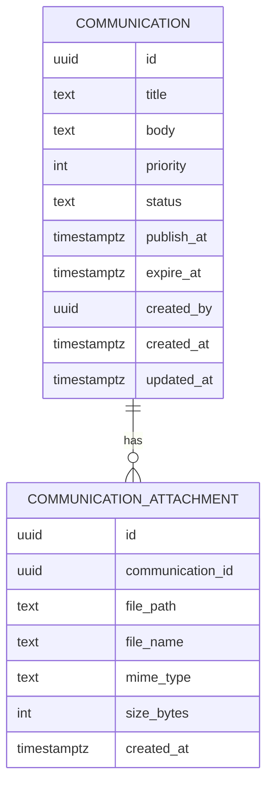

## 1.Architecture design


## 2.Technology Description
- Frontend: React@18 + TypeScript + router (ex: React Router) + UI (ex: TailwindCSS)
- Backend: Supabase (Auth + Database PostgreSQL + Storage)

## 3.Route definitions
| Route | Purpose |
|-------|---------|
| /dashboard | Dashboard étudiant avec carousel « Communication Center » (et retrait des sections « Continue learning » + « Weekly goal ») |
| /admin/communications | Admin Communication Center (liste, CRUD, scheduling, priorité, pièces jointes) |

## 6.Data model(if applicable)

### 6.1 Data model definition


### 6.2 Data Definition Language
Communication Table (communications)
```
CREATE TABLE communications (
  id UUID PRIMARY KEY DEFAULT gen_random_uuid(),
  title TEXT NOT NULL,
  body TEXT NOT NULL,
  priority INTEGER NOT NULL DEFAULT 0,
  status TEXT NOT NULL DEFAULT 'draft' CHECK (status IN ('draft','scheduled','published','archived')),
  publish_at TIMESTAMP WITH TIME ZONE NULL,
  expire_at TIMESTAMP WITH TIME ZONE NULL,
  created_by UUID NULL,
  created_at TIMESTAMP WITH TIME ZONE NOT NULL DEFAULT NOW(),
  updated_at TIMESTAMP WITH TIME ZONE NOT NULL DEFAULT NOW()
);

CREATE INDEX idx_communications_status_publish_at ON communications(status, publish_at DESC);
CREATE INDEX idx_communications_priority ON communications(priority DESC);
```

Attachment Table (communication_attachments)
```
CREATE TABLE communication_attachments (
  id UUID PRIMARY KEY DEFAULT gen_random_uuid(),
  communication_id UUID NOT NULL,
  file_path TEXT NOT NULL,
  file_name TEXT NOT NULL,
  mime_type TEXT NULL,
  size_bytes INTEGER NULL,
  created_at TIMESTAMP WITH TIME ZONE NOT NULL DEFAULT NOW()
);

CREATE INDEX idx_comm_attach_comm_id ON communication_attachments(communication_id);
```

Permissions (high-level)
```
-- Base grants (typical Supabase setup)
GRANT SELECT ON communications TO anon;
GRANT ALL PRIVILEGES ON communications TO authenticated;
GRANT SELECT ON communication_attachments TO anon;
GRANT ALL PRIVILEGES ON communication_attachments TO authenticated;
```

RLS (policy intentions, à implémenter)
- Étudiant (authenticated): SELECT uniquement sur communications "publiées" et "actives" (publish_at <= now() AND (expire_at IS NULL OR expire_at > now()) AND status='published').
- Admin (authenticated + claim/role admin): ALL sur communications et communication_attachments.

Storage
- Bucket: communication-attachments
- Les objets sont référencés par communication_attachments.file_path.
- Règles: lecture pour étudiants (si la communication associée est visible) et écriture/suppression réservées à l’admin.
