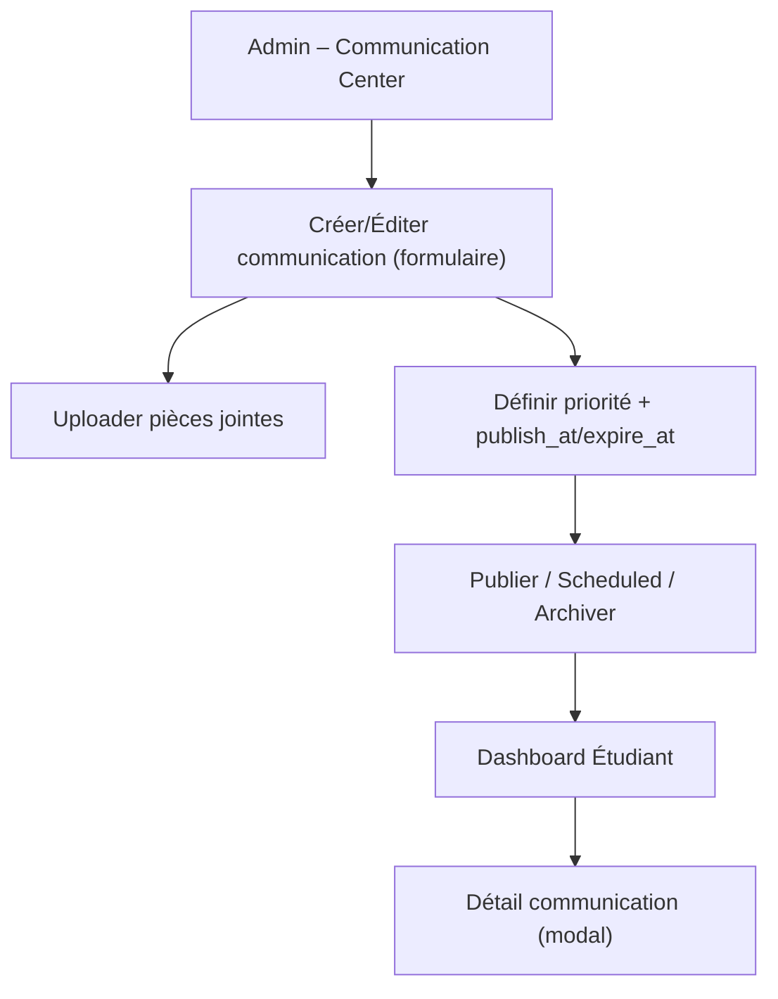

## 1. Product Overview
Remplacer la section **Announcements** par un **Communication Center** complet.
L’admin peut créer/éditer/programmer/prioriser des communications avec pièces jointes, et l’étudiant les voit sur son dashboard sous forme de carousel (en supprimant « Continue learning » et « Weekly goal »).

## 2. Core Features

### 2.1 User Roles
| Rôle | Méthode d’accès | Permissions clés |
|------|------------------|------------------|
| Admin | Connexion existante (back-office) | CRUD complet des communications, upload pièces jointes, scheduling, priorité, publication/archivage |
| Étudiant | Connexion existante (plateforme) | Voir les communications publiées sur le dashboard, ouvrir le détail, télécharger/ouvrir les pièces jointes |

### 2.2 Feature Module
Le produit nécessite les pages minimales suivantes :
1. **Dashboard Étudiant** : carousel de communications (tri priorité/date), ouverture du détail, accès aux pièces jointes, retrait des modules « Continue learning » et « Weekly goal ».
2. **Admin – Communication Center** : liste/filtre, création/édition, scheduling (date/heure), gestion de priorité, gestion des pièces jointes, actions publier/archiver.

### 2.3 Page Details
| Page Name | Module Name | Feature description |
|-----------|-------------|------------------|
| Dashboard Étudiant | Section « Communication Center » (carousel) | Afficher les communications **publiées** et **actives** (fenêtre publish/expiry) en carousel; trier par priorité décroissante puis date de publication décroissante; afficher aperçu (titre + extrait + date). |
| Dashboard Étudiant | Détail communication (modal/panneau) | Ouvrir une carte de communication en détail; afficher titre, contenu complet, date; lister pièces jointes avec action ouvrir/télécharger. |
| Dashboard Étudiant | Nettoyage de la page | Retirer/masquer les sections « Continue learning » et « Weekly goal » du dashboard. |
| Admin – Communication Center | Liste & recherche | Lister toutes les communications (draft/scheduled/published/archived); filtrer par statut; rechercher par titre; trier par updated_at ou publish_at. |
| Admin – Communication Center | Création / édition (CRUD) | Créer, modifier et supprimer une communication avec champs essentiels (titre, contenu); validation minimale (titre requis). |
| Admin – Communication Center | Scheduling & statut | Définir publish_at (programmation) et expire_at (fin d’affichage) optionnel; passer manuellement en draft/published/archived; afficher l’état « scheduled » si publish_at futur. |
| Admin – Communication Center | Priorité | Définir une priorité numérique; expliquer que plus grand = plus haut dans le carousel étudiant. |
| Admin – Communication Center | Pièces jointes | Uploader une ou plusieurs pièces jointes; afficher la liste des fichiers; retirer un fichier; conserver les métadonnées (nom/type/taille). |

## 3. Core Process
**Flux Admin**
1. Ouvrir « Admin – Communication Center ».
2. Créer une communication (titre + contenu).
3. (Optionnel) Ajouter des pièces jointes.
4. Définir priorité et scheduling (publish_at, expire_at).
5. Publier immédiatement ou laisser « scheduled » jusqu’à publish_at.
6. Archiver une communication qui ne doit plus apparaître.

**Flux Étudiant**
1. Ouvrir le dashboard.
2. Voir le carousel « Communication Center » avec les communications publiées (et non expirées).
3. Cliquer une carte pour lire le détail.
4. Ouvrir/télécharger une pièce jointe si disponible.

