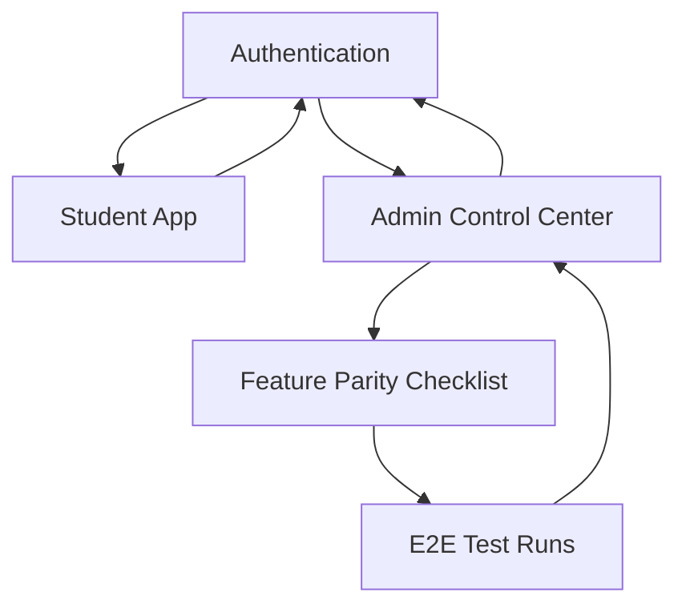

## 1. Product Overview
Refactor the existing platform into a clean, maintainable, production-ready system.
Deliver a full control-center Admin experience, a premium Student UX, remove dead/duplicate code, and verify feature parity end-to-end.

## 2. Core Features

### 2.1 User Roles
| Role | Registration Method | Core Permissions |
|------|---------------------|------------------|
| Student | Existing sign-up/sign-in flow (kept functionally identical) | Access all existing student-facing features and personal data |
| Admin | Existing admin provisioning method (kept functionally identical) | Full platform control center: manage users, configure settings, monitor platform health |

### 2.2 Feature Module
The refactored platform consists of the following main pages:
1. **Authentication**: sign in/up, session handling, password recovery (as currently supported).
2. **Student App**: premium student dashboard shell + access to all existing student features with improved UX consistency.
3. **Admin Control Center**: production-ready admin dashboard for full operational control and verification.

### 2.3 Page Details
| Page Name | Module Name | Feature description |
|-----------|-------------|---------------------|
| Authentication | Sign in / Sign up | Authenticate using the existing supported methods; prevent regressions in validation, errors, and redirects. |
| Authentication | Session management | Maintain session across refresh; handle expired sessions; support sign out. |
| Student App | App shell & navigation | Provide consistent layout (top nav/side nav as appropriate), clear information hierarchy, and fast page transitions to existing student features. |
| Student App | Core student feature access | Surface and link to all existing student features; preserve existing business rules and data visibility. |
| Student App | Profile & settings | View/update the existing student profile fields and settings; maintain permissions and validation. |
| Student App | UX quality bar | Improve visual consistency, spacing, typography, empty/loading/error states; keep behaviors unchanged. |
| Admin Control Center | Admin navigation & IA | Organize admin functions into a clear control-center structure; minimize clicks to reach frequent admin tasks. |
| Admin Control Center | User management | View users; perform existing admin actions on users; ensure permission gating and auditability. |
| Admin Control Center | Platform configuration | View/edit existing settings and configuration controls; prevent unsafe edits via confirmation and validation. |
| Admin Control Center | Monitoring & operations | Provide visibility into key operational states already available (e.g., jobs/statuses/logs if they exist today); highlight failures. |
| Admin Control Center | Audit & traceability | Record admin changes and show who changed what and when (at minimum for refactor-touched settings/actions). |
| Admin Control Center | Feature parity checklist | Provide an internal verification view linking each feature to its E2E test and status (pass/fail, last run). |
| All pages | Remove dead/duplicate code | Delete unused screens/components/hooks; consolidate duplicates into shared modules without changing behavior. |
| All pages | End-to-end verification | Ensure each feature works end-to-end in production-like environment; block release if critical flows fail. |

## 3. Core Process
### Student Flow
1. Student signs in.
2. Student lands in the Student App shell (dashboard entry point).
3. Student navigates to existing features from a consistent navigation system.
4. Student updates profile/settings as supported.
5. Student signs out.

### Admin Flow
1. Admin signs in.
2. Admin lands in the Admin Control Center.
3. Admin performs user management and configuration tasks with permission checks.
4. Admin reviews monitoring/operational states and addresses issues.
5. Admin reviews parity checklist and verifies critical E2E flows are passing.

### Refactor Release Verification Flow
1. Run automated lint/type/unit checks.
2. Run E2E suite covering all critical Student + Admin flows.
3. Verify parity checklist is green; only then promote the release.

