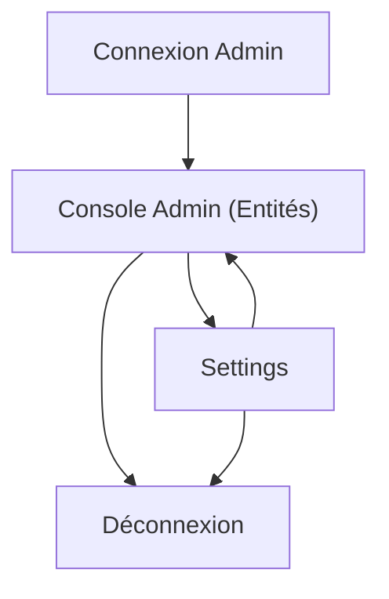

## 1. Product Overview
Reconstruire l’Admin Panel pour piloter toutes les entités métiers avec un contrôle complet (CRUD + upload), sans écrans ni actions “placeholder”.
L’Admin Panel doit être utilisable au quotidien par un administrateur pour publier, corriger, valider et maintenir les contenus.

## 2. Core Features

### 2.1 User Roles
| Rôle | Méthode d’inscription | Permissions clés |
|------|------------------------|------------------|
| Administrateur | Créé par l’équipe (dans la base) + login | Accès total aux entités, uploads, validation, settings |

### 2.2 Feature Module
Notre Admin Panel se compose des pages essentielles suivantes :
1. **Connexion Admin** : formulaire de connexion, gestion de session, redirection.
2. **Console Admin (Entités)** : sélection d’entité, liste + recherche/filtre, création/édition, suppression, uploads, validation/publication.
3. **Settings** : paramètres applicatifs, paramètres d’upload/stockage, sécurité (règles d’accès), infos système.

### 2.3 Page Details
| Page Name | Module Name | Feature description |
|-----------|-------------|---------------------|
| Connexion Admin | Authentification | Se connecter avec email/mot de passe.
- Afficher erreurs (401/403), état “loading”.
- Créer/rafraîchir la session et stocker le token.
- Rediriger vers Console Admin après succès |
| Connexion Admin | Sécurité session | Se déconnecter.
- Expirer la session et forcer la reconnexion si token invalide |
| Console Admin (Entités) | Navigation & garde d’accès | Afficher navigation (Entités, Settings).
- Bloquer l’accès si non-admin (403) |
| Console Admin (Entités) | Catalogue d’entités | Sélectionner l’entité à gérer (ex: Utilisateurs, Matières, Cours, Exercices, Devoirs, Parascolaire, Planner, Contacts).
- Charger dynamiquement la configuration des champs/formulaires |
| Console Admin (Entités) | Liste & recherche | Lister avec pagination.
- Rechercher (texte), filtrer (statut, matière, niveau, date…), trier.
- Afficher colonnes clés, statut (brouillon/publié/en attente) |
| Console Admin (Entités) | CRUD complet | Créer, éditer, consulter, supprimer.
- Validation côté client + messages d’erreur backend.
- Confirmation avant suppression.
- Rafraîchir la liste après action |
| Console Admin (Entités) | Upload & gestion média | Uploader fichiers (PDF, image, vidéo selon entité).
- Suivre progression, gérer erreurs.
- Associer/détacher un fichier à un enregistrement.
- Prévisualiser (thumbnail/nom/taille) |
| Console Admin (Entités) | Workflow de validation | Mettre “en attente”, approuver, rejeter.
- Journaliser l’action (qui/quand/quoi).
- Appliquer le statut dans la liste |
| Settings | Paramètres applicatifs | Lire/mettre à jour des réglages (ex: limites taille upload, extensions autorisées, titres/branding, modes de maintenance).
- Sauvegarder et afficher confirmation |
| Settings | Sécurité & rôles | Configurer les règles d’accès admin (ex: flag `role=admin`).
- Forcer déconnexion globale (option) |
| Settings | Observabilité | Consulter un journal des actions admin (création/édition/suppression/upload/validation) |

## 3. Core Process
**Flux Administrateur**
1) Ouvrir l’Admin Panel → se connecter.
2) Arriver sur Console Admin → choisir une entité.
3) Créer/éditer une fiche → éventuellement uploader un fichier → enregistrer.
4) Si applicable, passer en “en attente” puis approuver/rejeter.
5) Aller dans Settings → modifier un paramètre → sauvegarder.
6) Se déconnecter.

