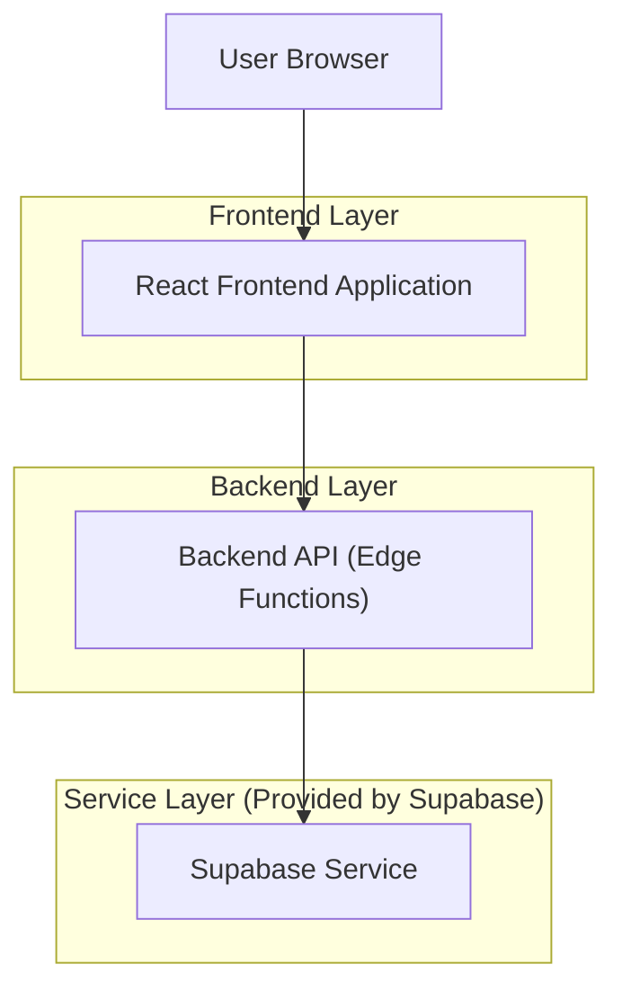
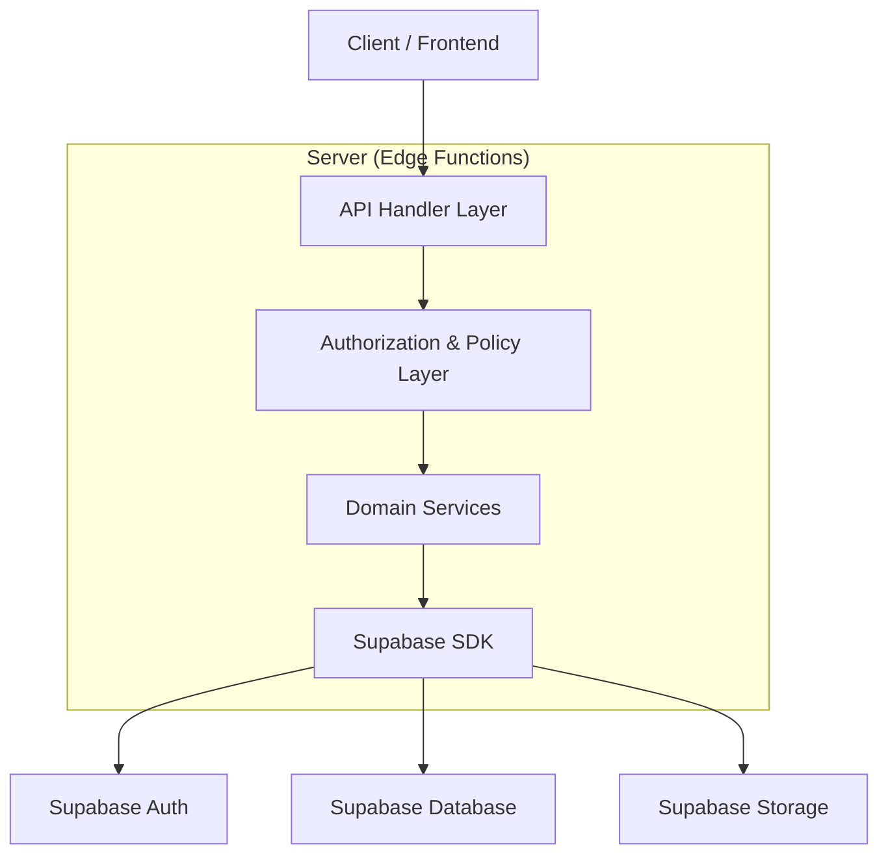
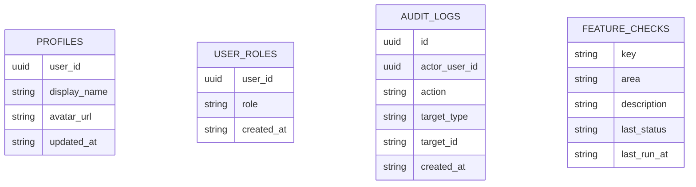

## 1.Architecture design


## 2.Technology Description
- Frontend: React@18 + TypeScript + vite + tailwindcss@3
- Backend: Supabase Edge Functions (TypeScript) using official Supabase SDK (server-side only)
- Service Layer: Supabase (Auth + PostgreSQL + Storage)
- Quality: eslint + prettier + Playwright (E2E) + Vitest (unit/integration)

## 3.Route definitions
| Route | Purpose |
|-------|---------|
| /login | Authentication entry (sign in/up + recovery as supported) |
| /student | Student app entry (dashboard shell) |
| /student/profile | Student profile and settings |
| /admin | Admin control center entry |
| /admin/users | User management views/actions |
| /admin/settings | Platform configuration surfaces |
| /admin/ops | Operational monitoring surfaces (only what exists today) |
| /admin/parity | Feature parity checklist linked to E2E results |

## 4.API definitions (If it includes backend services)
### 4.1 Shared TypeScript types
```ts
export type Role = "student" | "admin";

export type SessionUser = {
  id: string;
  email: string;
  roles: Role[];
};

export type AuditLog = {
  id: string;
  actorUserId: string;
  action: string;
  targetType: string;
  targetId?: string;
  metadata?: Record<string, unknown>;
  createdAt: string;
};

export type FeatureCheck = {
  key: string;
  area: "student" | "admin";
  description: string;
  lastRunAt?: string;
  lastStatus?: "pass" | "fail" | "unknown";
  evidenceUrl?: string;
};
```

### 4.2 Core API
Auth/session
```
POST /api/auth/login
POST /api/auth/logout
GET  /api/auth/me
```

Admin: user management (privileged)
```
GET  /api/admin/users
POST /api/admin/users/:id/action
```

Admin: configuration (privileged)
```
GET  /api/admin/settings
PUT  /api/admin/settings
```

Audit and parity visibility
```
GET /api/admin/audit
GET /api/admin/parity
```

Security notes (implementation requirements)
- Enforce authorization in backend (never trust frontend role claims alone).
- Use Supabase Auth for identity; backend validates JWT and maps to roles.
- Use service-role access only inside backend/Edge Functions (never ship to client).

## 5.Server architecture diagram (If it includes backend services)


## 6.Data model(if applicable)
### 6.1 Data model definition


### 6.2 Data Definition Language
Profiles (profiles)
```
CREATE TABLE IF NOT EXISTS profiles (
  user_id UUID PRIMARY KEY,
  display_name TEXT,
  avatar_url TEXT,
  updated_at TIMESTAMPTZ DEFAULT NOW()
);

CREATE TABLE IF NOT EXISTS user_roles (
  user_id UUID NOT NULL,
  role TEXT NOT NULL,
  created_at TIMESTAMPTZ DEFAULT NOW(),
  UNIQUE(user_id, role)
);

CREATE TABLE IF NOT EXISTS audit_logs (
  id UUID PRIMARY KEY DEFAULT gen_random_uuid(),
  actor_user_id UUID NOT NULL,
  action TEXT NOT NULL,
  target_type TEXT NOT NULL,
  target_id TEXT,
  created_at TIMESTAMPTZ DEFAULT NOW()
);

CREATE TABLE IF NOT EXISTS feature_checks (
  key TEXT PRIMARY KEY,
  area TEXT NOT NULL,
  description TEXT NOT NULL,
  last_status TEXT,
  last_run_at TIMESTAMPTZ
);

-- Baseline permissions guideline
GRANT SELECT ON profiles, feature_checks TO anon;
GRANT ALL PRIVILEGES ON profiles, user_roles, audit_logs, feature_checks TO authenticated;
```

Notes
- Domain-specific tables for existing student/admin features should be kept intact; refactor focuses on structure